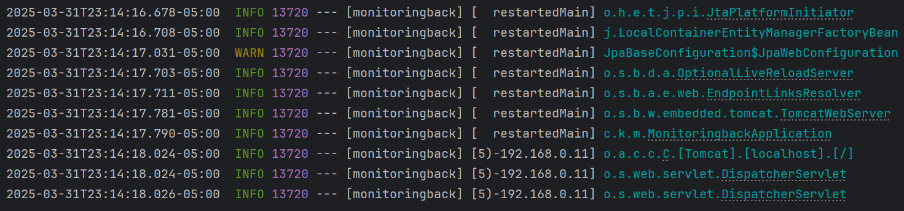
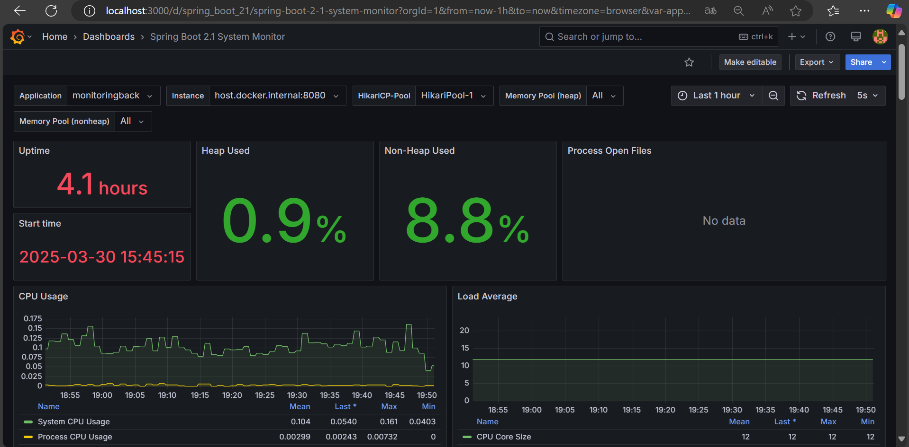
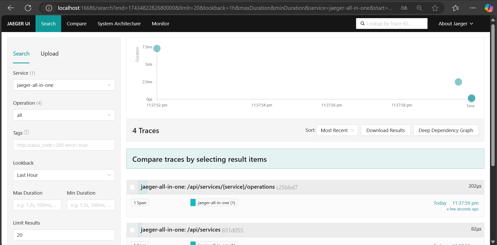

# **Spring Boot - Monitoring Tutorial**

* Katherin Juliana Moreno Carvajal
* Mariana Salas Gutiérrez
* Santiago Navarro Cuy

# Implementación de la Observabilidad

## Descripción de la Observabilidad

 La observabilidad en microservicios es fundamental para garantizar el correcto funcionamiento de sistemas distribuidos complejos,
 ya que permite obtener una visión clara del comportamiento de cada servicio en tiempo real. Mediante el uso de herramientas como logging, monitoring y tracing.

 - **Logging:** Se refiere al registro detallado de eventos que ocurren dentro de un microservicio, proporcionando información sobre su estado y ayudando a identificar errores. 
 - **Monitoring:**  Implica la recopilación de métricas en tiempo real sobre el rendimiento de los servicios, lo que permite detectar anomalías y responder proactivamente a problemas.
 - **Tracing:** Rastrea el recorrido de una solicitud a través de múltiples microservicios, facilitando la identificación de cuellos de botella y fallos en el sistema.

Estos conceptos, en conjunto, permiten una visibilidad completa, mejorando la eficiencia, reduciendo tiempos de respuesta y facilitando el diagnóstico de problemas en sistemas de microservicios.

---

## Estructura del Proyecto
La estructura del proyecto sigue el estándar de **Maven** y **Spring Boot**, también utilizando **Docker**:

```
DisenoCorte2
├── .mvn
│   └── maven-wrapper.properties  # Archivo de configuración de Maven Wrapper
├── config
|   ├── otel-collector-config.yml # Configuración para usar Jaeger
│   └── prometheus.yml            # Configuración de Prometheus para la recolección de métricas
├── docker-compose.yml            # Configuración de Docker Compose para gestionar los contenedores
├── pom.xml                       # Archivo de configuración de Maven
├── README.md                     # Documentación del proyecto
├── images                        # Carpeta de imágenes para la documentación
├── src
│   ├── main
│   │   ├── java
│   │   │   └── com
│   │   │       └── kjuli
│   │   │           └── monitoringback
│   │   │               ├── api                              # Lógica de la API
│   │   │               ├── controller                       # Controladores de las solicitudes HTTP
│   │   │               ├── dto                              # Objetos de transferencia de datos
│   │   │               ├── enums                            # Definición de enumeraciones
│   │   │               ├── exception                        # Manejo de excepciones
│   │   │               ├── mapper                           # Clases para mapear datos entre entidades y DTOs
│   │   │               ├── model                            # Clases de modelos para representar datos
│   │   │               ├── MonitoringbackApplication.java   # Clase principal de la aplicación Spring Boot
│   │   │               ├── repository                       # Repositorios para interactuar con la base de datos
│   │   │               └── services                         # Servicios con lógica de negocio
│   │   └── resources
│   │       ├── application.properties   # Configuraciones de la aplicación Spring Boot
│   │       └── data.sql                 # Script de base de datos
│   └── test
└── target   # Directorio donde Maven coloca los archivos generados tras la compilación
```

---

## Dependencias Utilizadas

Este proyecto utiliza dependencias adicionales que deban ser definidas en el archivo **pom.xml**:
- Spring Boot Starter Data JPA
- Spring Boot Starter Web
- Spring Boot Starter Validation
- Spring Boot DevTools
- H2 Database
- Spring Boot Starter Test
- MapStruct
- Lombok
- Lombok MapStruct Binding
- Spring Boot Starter Actuator

---

## Instrucciones de Instalación

1. **Instalar Docker:**
[Descargar Docker](https://docs.docker.com/desktop/setup/install/windows-install/)
   
2. **Clonar el repositorio:**
```bash
git clone https://github.com/Syreus311/DisenoCorte2.git
```

3. **Compilar el proyecto:**
```Símbolo del Sistema
cd C:\Users\marim\SOFTWARE_CORTE_2\SOFTWARE_CORTE02 # Cambiar a la ubicación del repositorio clonado, donde se encuentra el archivo: docker-compose.yml
docker-compose up -d
docker ps
```

4. **Correr el proyecto:**
Iniciar el programa desde la clase principal: MonitoringbackApplication.java

5. **Abrir Prometheus:**
```Navegador
http://localhost:9090
```

6. **Abrir Jaeger:**
```Navegador
http://localhost:16686
```

7. **Abrir Grafana:**
```Navegador
http://localhost:3000
```

---

## Ejemplo de Ejecución
Al ejecutar el programa, deberías ver la siguiente salida:


Al ingresar los comandos establecidos para Docker en el apartado anterior, deberías ver la siguiente salida:


Al abrir los respectivos localhost, deberían aparecer las siguientes salidas: 


En Prometheus, puedes ingresar el comando *system_cpu_count* y se imprime en la interfaz el siguiente mensaje:
*system_cpu_count{application="monitoringback", instance="host.docker.internal:8080", job="spring-boot-monitoring-app"}*

Para el funcionamiento de Grafana:
1. Se hace login con el usuario de *admin* y la contraseña de *admin*.
2. Se ingresan las nuevas contraseñas de tu elección, pueden continuar siendo *admin*.
3. Se selecciona añadir "Data Source". Luego, Prometheus.
4. En "Connection", se pone como Prometheus Server URL: http://prometheus:9090
5. Se guardan los cambios.
6. Ir a la sección de "Dashboard".
7. Descargar como JSON el dashboard del link a continuación: [Descargar Spring Boot 2.1 System Monitor](https://grafana.com/grafana/dashboards/11378-justai-system-monitor/)
8. De vuelta a Grafana, seleccionar del desplegable de "New" la opción "Importar" y subir el archivo JSON del paso anterior. IMPORTANTE: Escoger a Prometheus como datasource
9. Visualizar las gráficas y métricas.



Finalmente, en Jaeger se selecciona el servicio y se oprime el botón "Find Traces". Se obtiene la siguiente salida:


---

## Explicación de la Implementación
- **Prometheus** es una herramienta de monitoreo y recolección de métricas basada en series temporales. En este proyecto, Prometheus se encarga de recolectar métricas del sistema, como el uso de CPU, la memoria, el tráfico de red, entre otros. La configuración en el archivo prometheus.yml define el scraping (recolecta) de métricas de un servicio de Spring Boot a través del endpoint /actuator/prometheus, que expone las métricas de la aplicación. En el archivo docker-compose.yml, se configura el contenedor de Prometheus para que esté disponible en el puerto 9090, permitiendo la recolección de métricas de la aplicación. Además, la dependencia en el archivo pom.xml micrometer-registry-prometheus permite que Spring Boot exponga las métricas en el formato adecuado para que Prometheus las recoja.

- **Grafana** es una herramienta de visualización que permite crear dashboards interactivos para mostrar las métricas recolectadas por Prometheus. En el archivo docker-compose.yml, se configura el servicio de Grafana, expuesto en el puerto 3000. En Grafana, se puede crear un panel que se conecta a Prometheus como fuente de datos, lo que permite visualizar las métricas en tiempo real. Los dashboards creados en Grafana proporcionan una representación gráfica de los datos del sistema, como el uso de CPU, la latencia de las peticiones y otros indicadores clave de rendimiento (KPI). Grafana facilita el monitoreo continuo y la identificación de problemas en el sistema.

- **Jaeger** es una herramienta de rastreo distribuido (tracing) que se utiliza para seguir el flujo de las solicitudes entre los microservicios. En el archivo docker-compose.yml, se configura el servicio de Jaeger, que incluye puertos para la comunicación con el agente de Jaeger y para la visualización de trazas a través de su interfaz. Jaeger permite rastrear las solicitudes a través de los diferentes microservicios, lo que ayuda a identificar cuellos de botella, latencia o posibles fallos en los servicios. La integración con Spring Boot se logra mediante la dependencia jaeger-client en el archivo pom.xml, permitiendo que las solicitudes generen trazas que se envían a Jaeger para su visualización y análisis. Esto es crucial para mantener la salud de un sistema distribuido, ya que proporciona visibilidad en el flujo de datos entre servicios.
---
